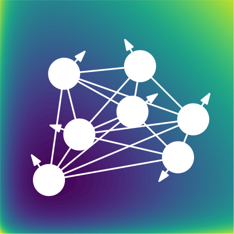

</img>

# Approximate Free-Energy Minimization

Experimental implementation of approximate free-energy minimization in PyTorch.

**Blog post: [Transformers from Spin Models: Approximate Free Energy Minimization](https://mcbal.github.io/post/transformers-from-spin-models-approximate-free-energy-minimization/)**

## Setup

Install package in editable mode:

```bash
$ pip install -e .
```

Run (very slow) tests with:

```bash
$ python -m unittest
```